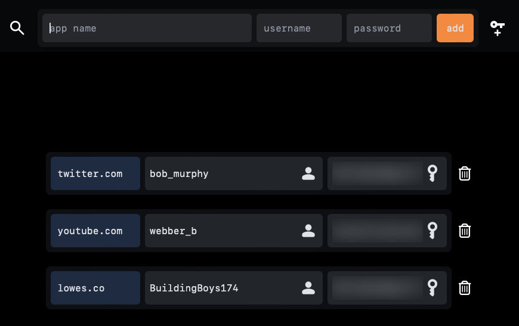
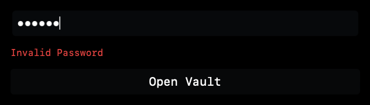

# Password Manager 

Lightweight and secure password manager build with the Tauri framework and a Sveltekit frontend. Learning Project for both Tauri and Rust. Binary is somewhat out of date and not indended for acutal use currently. The password maneger has an advanced encryption scheme and a modern UI. 

### Features  
Fuzzy Find, Password generator, quick copy, keyboard shortcuts, location caching, responsive UI. 



### Secure
Full and fast layered AES encryption with Rust.  



### Install

```sh
# requires tauri cli
npm i
cargo tauri dev
```


